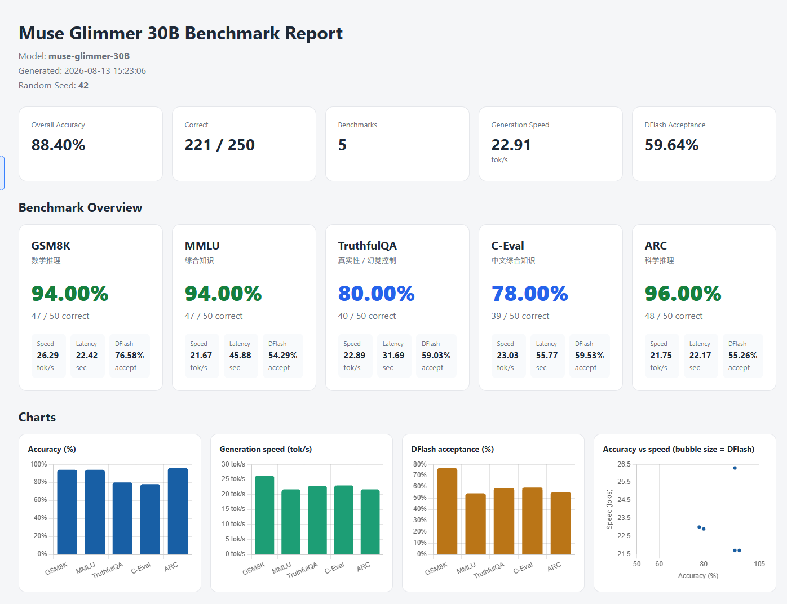

# 本地大模型评测体系 (Local LLM Benchmark Suite)

面向**硬件产品本地 AI 能力验证**的端侧评测框架：对 llama.cpp OpenAI 兼容端点上部署的量化模型（GGUF），在本地完成 5 大标准任务评测 + 端侧性能指标采集，输出可复现、可审计、可交付的多格式报告。

与云端全精度的传统模型评测不同，本框架测量的是"**模型 × 量化 × 本地硬件**"的端到端表现——速度、延迟、投机解码效率是硬件产品的核心卖点数据。

---

## 实测效果

在 **AMD Strix Halo**（128GB 统一内存，Radeon 8060S 核显，Vulkan 后端）上加载 **muse-glimmer-30B-Q4_K_M** GGUF，开启 DFlash 投机解码，50 题/任务，seed 42 的完整评测：

| 任务 | 准确率 | 速度 | DFlash |
|---|---:|---:|---:|
| **GSM8K**（数学推理） | **94%** | 26.29 tok/s | 76.58% |
| **MMLU**（综合知识） | **94%** | 21.67 tok/s | 54.29% |
| **TruthfulQA**（真实性） | **80%** | 22.89 tok/s | 59.03% |
| **C-Eval**（中文知识） | **78%** | 23.03 tok/s | 59.53% |
| **ARC**（科学推理） | **96%** | 21.75 tok/s | 55.26% |
| **Overall** | **88.40%** (221/250) | **22.91 tok/s** | **59.64%** |



**在线预览**：
- 🎨 **项目展示页**（多模型对比 · 作品集风格）：https://shiny-sable-611534.netlify.app/
- 📊 **完整交互报告**（muse-glimmer-30B · 四图）：https://gorgeous-marshmallow-cf24e2.netlify.app/

**更多示例结果**（含 Qwen3.5-35B-A3B 对比）：见 [`docs/reports/`](docs/reports/README.md)

---

## 核心特性

- **全本地化运行**：5 个数据集（GSM8K / MMLU / TruthfulQA / C-Eval / ARC，2 万+ 题）本地缓存，**断网可跑**
- **可复现对比**：固定 seed 抽样，不同模型/版本使用完全相同的题目，横向可比
- **数据可信度**：数据集 sha256 指纹 + 结构校验，评测前自动拦截被篡改/替换的数据
- **多模型隔离**：结果按模型自动分目录（`results/<model>/`），一条命令产出多模型对比报告
- **端侧性能采集**：生成速度 (tok/s)、端到端延迟、DFlash 投机解码接受率——硬件产品的独有卖点数据
- **思考模型兼容**：自动处理 `reasoning_content` 兜底（Qwen3.5-A3B 等深度思考模型）
- **自动化报告**：一键生成带交互图表（准确率 / 速度 / DFlash / 双维散点）的 HTML + Markdown + CSV

---

## 快速开始（Ubuntu）

### 1. 安装依赖

```bash
pip install requests datasets
```

### 2. 生成数据缓存（一次性联网，之后全离线）

```bash
python scripts/prepare_data.py            # 生成 data/mmlu_all.json + data/arc_test.json
# GSM8K / TruthfulQA / C-Eval 在评测时若缺缓存会自动从 HuggingFace 构建
```

### 3. 启动推理服务

```bash
llama-server -m /path/to/model-Q4_K_M.gguf -ngl 99
```

模型名自动从 `/v1/models` 抓取（路径会自动转为友好名）。

### 4. 跑评测

```bash
./run_all_50.sh                # 全部 5 任务 × 50 题（seed 42）
./run_all_50.sh 200            # 自定义题量
./run_all_50.sh 100 gsm8k,mmlu # 只跑指定任务
```

### 5. 生成报告

```bash
python generate_report.py      # 自动为每个模型生成独立报告
```

输出：
- `results/<模型名>/benchmark_report.md`
- `results/<模型名>/benchmark_summary.csv`
- `results/<模型名>/benchmark_report.html`（带交互图表）

---

## 项目结构

```
├── run_benchmark.py          # 单任务评测入口
├── run_all_50.sh             # 批量评测脚本（可传题量/任务）
├── generate_report.py        # 报告生成（自动发现多模型）
├── core/
│   ├── api.py                # OpenAI 兼容 API 封装（模型自动识别 + reasoning 兜底）
│   └── datacheck.py          # 数据集指纹/结构校验
├── benchmarks/               # 5 个评测任务模块
│   └── gsm8k.py  mmlu.py  arc.py  ceval.py  truthfulqa.py
├── scripts/
│   ├── prepare_data.py       # MMLU / ARC 本地缓存生成（一次性联网）
│   ├── check_gsm8k.py        # GSM8K 本地 vs 官方一致性校验 / 重建
│   └── check_data.py         # 全部数据集指纹 + 结构体检
├── docs/
│   ├── images/sample-report.png   # 示例报告截图（README 引用）
│   ├── showcase.html              # 项目展示页（作品集风格，可部署）
│   └── reports/                   # 示例评测报告（多模型，含备注说明）
└── README.md
```

`data/`（数据集缓存）和 `results/`（评测输出）由 `.gitignore` 忽略——前者可由脚本自动重建，后者由评测自动生成，保持仓库精简。

---

## 数据集

| 任务 | 数据集 | 全量 | 缓存策略 |
|---|---|---:|---|
| GSM8K | openai/gsm8k | 1,319 | 本地 jsonl |
| MMLU | cais/mmlu | 14,042 | 本地 json |
| TruthfulQA | truthfulqa/truthful_qa | 817 | 本地 json |
| C-Eval | ceval/ceval-exam | 1,346 | 本地 json |
| ARC | allenai/ai2_arc | 1,172 | 本地 json |

**数据可信度保证**：
```bash
python scripts/check_data.py --fingerprint   # 数据重建后重新生成指纹
python scripts/check_data.py                 # 全量体检（hash + 结构）
```
评测启动时（`run_benchmark.py`）会自动校验——文件被改动/替换即拒绝运行。

---

## 评测方法论

评测结果拆分为两个维度，交付时建议区分呈现：

- **能力维（参考）**：5 任务准确率。是"模型 × 量化 × 本地硬件 × 评测 prompt"的**联合指标**，与模型厂商官方数据（云端全精度、全量题库、官方模板）**不可直接比较**。固定 seed 下可用于模型选型与版本对比。
- **性能维（硬件卖点）**：生成速度、延迟、DFlash 投机解码接受率——硬件产品独有的端侧指标。

> 50 题抽样的 95% 置信区间约 ±14 个百分点，分数定位为"相对参考标尺"而非绝对能力值。要做更精确的横向评测，把样本量提到 200+ 即可。

---

## 命令行参考

```bash
# 单任务评测
python run_benchmark.py --bench gsm8k --limit 50 --seed 42 [--model 模型名]

# 数据准备
python scripts/prepare_data.py [--only mmlu|arc]

# 数据校验
python scripts/check_data.py [--bench gsm8k] [--fingerprint]

# GSM8K 官方一致性校验 / 重建
python scripts/check_gsm8k.py [--fix] [--report out.json]
```

---

## 常见问题

**Q：模型输出为空（Predicted: None）？**
深度思考模型（Qwen3.5 等）可能把全部内容放进 `reasoning_content` 导致 `content` 为空。本框架已在评测端做兜底（自动从 reasoning 提取），更推荐服务端加 `--reasoning off` 保证输出稳定。

**Q：换模型后速度减半？**
投机解码（DFlash）需要匹配的 draft 模型：`-md draft.gguf --spec-type draft-dflash`。

**Q：报告标题/模型名不对？**
模型名自动从 `/v1/models` 抓取并转为友好名（去路径、去 .gguf）；结果按模型分目录，报告标题自动跟随。

**Q：50 题抽样够不够？**
够"相对参考"（横向比模型/版本）；要做精确评测可以提到 200+。交付时明确标注口径"50 题 seed 42 抽样，置信区间 ±14pp"。

**Q：能跑在 Apple Silicon / 纯 CPU 上吗？**
可以。`-ngl 99` 是 Vulkan/GPU 用，纯 CPU 用 `-ngl 0`。但速度会显著下降，端到端体验和量化参数都需要重新评估——这也是本框架存在的意义之一。

---

## License

MIT